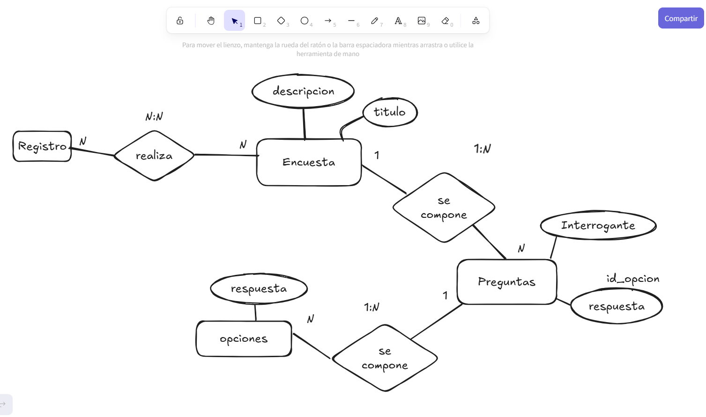

# Prueba Tecnica Vip2Cars


-----

## Requisitos del Entorno

El entorno de desarrollo tiene que cumplir con los siguientes requisitos para ejecutar la aplicación:

  * **PHP:** Versión 8.2 o superior
  * **Base de Datos:** MySQL
  * **Composer:** Versión 2.0 o superior
  * **Node.js & NPM:** Versión 18.0 o superior

-----

## Instalacióon y Configuracion

1.  Clona el repositorio desde GitHub:

    ```bash
    git clone https://github.com/Paul-Asto/Prueba-Tecnica-Vip2Cars.git
    cd Prueba-Tecnica-Vip2Cars
    ```

2.  Instala las dependencias de PHP con Composer:

    ```bash
    composer install
    ```

3.  Crea una copia del archivo de variables de entorno:

    ```bash
    cp .env.example .env
    ```

4.  Genera la clave de aplicación de Laravel:

    ```bash
    php artisan key:generate
    ```

5.  Configura las credenciales de tu base de datos en el archivo `.env`.

    ```ini
    DB_CONNECTION=mysql
    DB_HOST=127.0.0.1
    DB_PORT=3306
    DB_DATABASE= #nombre_de_tu_db
    DB_USERNAME= #tu_usuario
    DB_PASSWORD= #tu_contraseña
    ```

-----

## Ejecucion

1.  Ejecuta las migraciones para crear las tablas en la base de datos:

    ```bash
    php artisan migrate
    ```

2.  Ejecuta los seeds para generar valores iniciales en la base de datos:

    ```bash
    php artisan db:seed
    ```

3.  Inicia el servidor de desarrollo de Laravel:

    ```bash
    php artisan serve
    ```


5.  Accede a la aplicación en tu navegador en `http://127.0.0.1:8000`.

-----

## Estructura de la Base de Datos

``` py

# Migracion de la entidad Marca
return new class extends Migration
{
    /**
     * Run the migrations.
     */
    public function up(): void
    {
        Schema::create('marcas', function (Blueprint $table) {
            $table->id()->autoIncrement();
            $table->string("nombre", 25)->nullable(false);
            $table->timestamps();
        });
    }

    /**
     * Reverse the migrations.
     */
    public function down(): void
    {
        Schema::dropIfExists('marcas');
    }
};

# Migracion de la entidad Modelo
return new class extends Migration
{
    /**
     * Run the migrations.
     */
    public function up(): void
    {
        Schema::create('modelos', function (Blueprint $table) {
            $table->id()->autoIncrement();
            $table->string("nombre", 25)->nullable(False);
            $table->unsignedBigInteger('id_marca');
            $table->foreign("id_marca")->references("id")->on("marcas");
            $table->timestamps();
        });
    }

    /**
     * Reverse the migrations.
     */
    public function down(): void
    {
        Schema::dropIfExists('modelos');
    }
};

# Migracion de la entidad Propietario
return new class extends Migration
{
    /**
     * Run the migrations.
     */
    public function up(): void
    {
        Schema::create('propietarios', function (Blueprint $table) {
            $table->uuid("id")->primary();
            $table->string("nombre", 25)->nullable(false);
            $table->string("apellidos", 25)->nullable(false);
            $table->string("dni", 8)->nullable(false);
            $table->string("correo", 50)->nullable();
            $table->string("telefono", 20)->nullable();
            $table->timestamps();
        });
    }

    /**
     * Reverse the migrations.
     */
    public function down(): void
    {
        Schema::dropIfExists('propietarios');
    }
};


# Migracion de la entidad Vehiculo
return new class extends Migration
{
    /**
     * Run the migrations.
     */
    public function up(): void
    {
        Schema::create('vehiculos', function (Blueprint $table) {
            $table->uuid("id")->primary();
            $table->string("placa", 10);
            $table->integer("año_fabricacion");
            $table->unsignedBigInteger('id_modelo');
            $table->uuid("id_propietario");
            $table->foreign("id_modelo")->references("id")->on("modelos");
            $table->foreign("id_propietario")->references("id")->on("propietarios");
            $table->timestamps();

        });
    }

    /**
     * Reverse the migrations.
     */
    public function down(): void
    {
        Schema::dropIfExists('vehiculos');
    }
};

```
## Rutas de la API
```
    GET     http://localhost/api/v1/vehiculo        -> Devuelve todos los vehiculos
    GET     http://localhost/api/v1/vehiculo/id     -> Devuelve un vehiculo que coincida con el id del parametro
    POST    http://localhost/api/v1/vehiculo/       -> Crea un nuevo vehiculo siempre y cuando se le pasen los parametros 
                                                       correctos en el cuerpo de la peticion
    PUT     http://localhost/api/v1/vehiculo/id     -> Modifica el vehiculo con el id especificado, modifica los campos con 
                                                        los valores validos pasados en el cuerpo de la peticion
    DELETE  http://localhost/api/v1/vehiculo/id     -> Elimina el vehiculo con el id especificado


    GET     http://localhost/api/v1/propietario        -> Devuelve todos los propietarios
    GET     http://localhost/api/v1/propietario/id     -> Devuelve un propietario que coincida con el id del parametro
    POST    http://localhost/api/v1/vpropietario/       -> Crea un nuevo propietario siempre y cuando se le pasen los parametros 
                                                       correctos en el cuerpo de la peticion
    PUT     http://localhost/api/v1/propietario/id     -> Modifica el propietario con el id especificado, modifica los campos con 
                                                        los valores validos pasados en el cuerpo de la peticion
    DELETE  http://localhost/api/v1/propietario/id     -> Elimina el propietario con el id especificado


    GET     http://localhost/api/v1/marca        -> Devuelve todas las marcas
    GET     http://localhost/api/v1/marca/id     -> Devuelve una marca que coincida con el id del parametro
    POST    http://localhost/api/v1marca/       -> Crea una nueva marca siempre y cuando se le pasen los parametros 
                                                       correctos en el cuerpo de la peticion
    PUT     http://localhost/api/v1/marca/id     -> Modifica la amrca con el id especificado, modifica los campos con 
                                                        los valores validos pasados en el cuerpo de la peticion
    DELETE  http://localhost/api/v1/marca/id     -> Elimina la marca con el id especificado
   

    GET     http://localhost/api/v1/modelo        -> Devuelve todos los mdelos
    GET     http://localhost/api/v1/modelo/id     -> Devuelve un modelo que coincida con el id del parametro
    POST    http://localhost/api/v1/modelo/       -> Crea un nuevo modelo siempre y cuando se le pasen los parametros 
                                                       correctos en el cuerpo de la peticion
    PUT     http://localhost/api/v1/modelo/id     -> Modifica el modelo con el id especificado, modifica los campos con 
                                                        los valores validos pasados en el cuerpo de la peticion
    DELETE  http://localhost/api/v1/mdelo/id     -> Elimina el modelo con el id especificado
```

## Modelo de Encuestas Anonimas
El modelo de encuestas anonimas se comforma de 4 entidades:

- Las encuestas: Son un grupo de preguntas, tienen un titulo y una descripcion acerca de la tematica de las preguntas

- Las preguntas: tienen la informacion de lo que se preguntara, ademas de la respuesta ideal, pertenecen a una encuesta

- Las Opciones: representa la cantidad de opciones que tiene una pregunta y que un registro puede elegir

- Registros: Es el registro de el resultado de una pregunta, adjuntando la respuesta, realizado en cierta encuesta, son los datos totales que tiene informacion del total de registros hechos y estadisticas de error y acierto en las preguntas de cada encuesta


